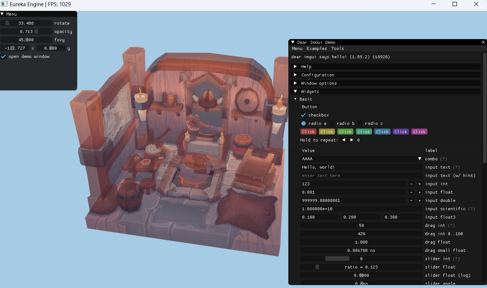

# Eureka Engine

Eureka Engine, a scratch engine for learning purpose.

This engine is mainly for self-learning to build game engine, it also highlights the focus on graphics rendering and add a touch of creativity. 

It is the place to collect my _Eureka_ moment😊.

## Screenshots

## Plan

- [ ] basic rendering system with raw Vulkan binding from ash crate

